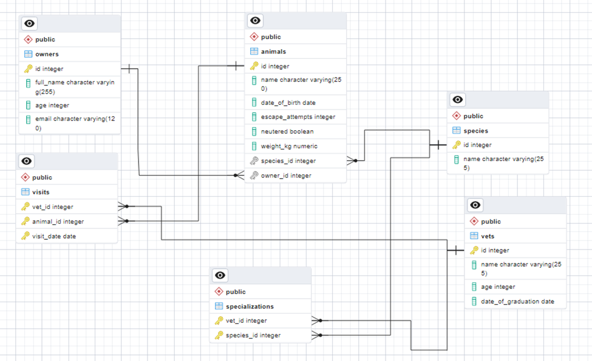

<a name="readme-top"></a>

<!--
HOW TO USE:
This is an example of how you may give instructions on setting up your project locally.

Modify this file to match your project and remove sections that don't apply.

REQUIRED SECTIONS:
- Table of Contents
- About the Project
  - Built With
  - Live Demo
- Getting Started
- Authors
- Future Features
- Contributing
- Show your support
- Acknowledgements
- License

After you're finished please remove all the comments and instructions!
-->

<!-- TABLE OF CONTENTS -->

# 📗 Table of Contents

- [📖 About the Project](#about-project)
  - [🛠 Built With](#built-with)
    - [Tech Stack](#tech-stack)
    - [Key Features](#key-features)
    <!-- - [🚀 Live Demo](#live-demo) -->
- [💻 Getting Started](#getting-started)
  - [Setup](#setup)
  - [Prerequisites](#prerequisites)
  - [Install](#install)
  <!-- - [Usage](#usage) -->
  <!-- - [Run tests](#run-tests) -->
  <!-- - [Deployment](#triangular_flag_on_post-deployment) -->
- [👥 Authors](#authors)
- [🔭 Future Features](#future-features)
- [🤝 Contributing](#contributing)
- [⭐️ Show your support](#support)
- [🙏 Acknowledgements](#acknowledgements)
<!-- - [❓ FAQ](#faq) -->
- [📝 License](#license)

<!-- PROJECT DESCRIPTION -->

# 📖 [Vet-clinic] <a name="about-project"></a>

> This project about converting the schema diagram into the sql commands using the postgresql, contains table for the patients.

**[Vet-clinic]** is a table contains patients details.

## 🛠 Built With <a name="built-with"></a>

- Sql commands
- Postgresql
- schema diagram

### Tech Stack <a name="tech-stack"></a>

> Describe the tech stack and include only the relevant sections that apply to your project.

<details>
<summary>Database</summary>
  <ul>
    <li><a href="https://www.postgresql.org/">PostgreSQL</a></li>
  </ul>
</details>

<!-- Features -->

### Key Features <a name="key-features"></a>

> Describe between 1-3 key features of the application.

- Schema based on diagram😊👌
- OPtimization the foreign key with indexing💯
- Use the many to many relationship🚀
- Schema Diagram image :


<p align="right">(<a href="#readme-top">back to top</a>)</p>

<!-- LIVE DEMO -->
<!--
## 🚀 Live Demo <a name="live-demo"></a>

> Add a link to your deployed project.

- [Live Demo Link](<replace-with-your-deployment-URL>) -->

<p align="right">(<a href="#readme-top">back to top</a>)</p>

<!-- GETTING STARTED -->

## 💻 Getting Started <a name="getting-started"></a>

> Describe how a new developer could make use of your project.

To get a local copy up and running, follow these steps.

### Prerequisites

In order to run this project you need:


```sh
 1.use a browser
2.use cable internet
```


### Setup

Clone this repository to your desired folder:


```sh
  cd my-folder
  git clone git@github.com:ShaliniNayan/Vet-clinic.git
```
-

<!-- ### Install -->

<!-- Install this project with:

<!--
Example command:

```sh
  cd my-project
  gem install
```
---> 

<!-- ### Usage -->

<!-- To run the project, execute the following command: -->

<!--
Example command:

```sh
  rails server
```
--->

<!-- ### Run tests

To run tests, run the following command: -->

<!--
Example command:

```sh
  bin/rails test test/models/article_test.rb
```
--->

<!-- ### Deployment

You can deploy this project using: -->

<!--
Example:

```sh

```
 -->

<p align="right">(<a href="#readme-top">back to top</a>)</p>

<!-- AUTHORS -->

## 👥 Authors <a name="authors"></a>

> Mention all of the collaborators of this project.

👤 **Author1**

- GitHub: [@ShaliniNayan](https://github.com/ShaliniNayan)
- Twitter: [@sndprs](https://twitter.com/sndprs)
- LinkedIn: [shalininayan](https://www.linkedin.com/in/shalininayan/)

<p align="right">(<a href="#readme-top">back to top</a>)</p>

<!-- FUTURE FEATURES -->

## 🔭 Future Features <a name="future-features"></a>

> Describe 1 - 3 features you will add to the project.

- [ ] Enhance the sql commands using query plan.
- [ ] Add more tables💯.
- [ ] Add other relationships to the tables.

<p align="right">(<a href="#readme-top">back to top</a>)</p>

<!-- CONTRIBUTING -->

## 🤝 Contributing <a name="contributing"></a>

Contributions, issues, and feature requests are welcome!

Feel free to check the [issues page](../../issues/).

<p align="right">(<a href="#readme-top">back to top</a>)</p>

<!-- SUPPORT -->

## ⭐️ Show your support <a name="support"></a>

> If you like this project kindly give it a star⭐️.

<p align="right">(<a href="#readme-top">back to top</a>)</p>

<!-- ACKNOWLEDGEMENTS -->

## 🙏 Acknowledgments <a name="acknowledgements"></a>

> Give credit to everyone who inspired your codebase.

I'm thankful to Microverse for providing a study platform which guided me through this project

<p align="right">(<a href="#readme-top">back to top</a>)</p>


<p align="right">(<a href="#readme-top">back to top</a>)</p>

<!-- LICENSE -->

## 📝 License <a name="license"></a>

This project is [MIT](./LICENSE) licensed.

_NOTE: we recommend using the [MIT license](https://choosealicense.com/licenses/mit/) - you can set it up quickly by [using templates available on GitHub](https://docs.github.com/en/communities/setting-up-your-project-for-healthy-contributions/adding-a-license-to-a-repository). You can also use [any other license](https://choosealicense.com/licenses/) if you wish._

<p align="right">(<a href="#readme-top">back to top</a>)</p>
